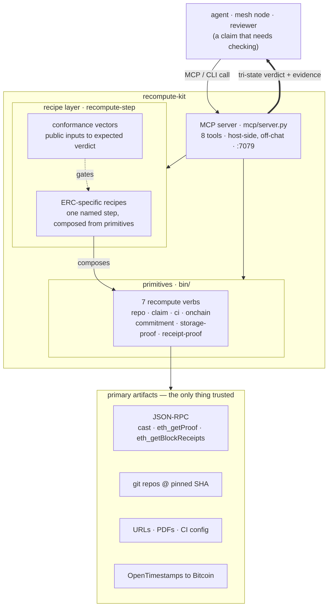

# recompute-kit

**Don't trust — recompute.** A toolchain for verifying others' work the way it should be
verified: re-derived yourself from the primary artifact, pinned to an exact reference, with the
evidence attached. Every answer is **tri-state** — `verified-good` / `verified-bad` /
`UNVERIFIABLE` — because *"couldn't check"* is its own verdict, never a silent pass.

The method is in **[RECOMPUTE.md](./RECOMPUTE.md)** — read that first; it's the point. Everything
below is that doctrine made callable, by hand (`bin/`) or by an agent (the MCP server).

## Architecture



Two layers. **Primitives** (`bin/`) are the atomic recompute verbs. The **recipe layer**
(`recompute-step`) composes them into one named, ERC-specific step, and the **conformance
vectors** gate every recipe against `public inputs to expected verdict` so no implementation
is trusted — not even this one. The **MCP server** exposes all of it so an agent holds *itself*
to recompute-don't-trust; the heavy work (clone/compile/test, proof fetch, PDF extract) runs
host-side, off the chat, and only the verdict + a short evidence tail crosses the wire.

## The verdict is tri-state

| exit | verdict | meaning | gate |
|:---:|---|---|---|
| `0` | **verified-good** | re-derived and it matches | proceed |
| `1` | **verified-bad** | re-derived and it does **not** match | deny |
| `2` | **UNVERIFIABLE** | couldn't fetch / run / prove | fail-closed if irreversible, else annotate |

Irreversible actions fail-closed on UNVERIFIABLE; reversible ones annotate. An unverifiable
off-chain value can never manufacture a pass.

## Layer 1 — primitives (`bin/`)

| verb | recomputes | against |
|---|---|---|
| `recompute-repo` | a leg/repo — clone @ exact SHA, run its tests **yourself** | the resolved commit |
| `verify-claim` | a citation — which claim-terms actually appear in the source | the URL / PDF text |
| `recheck-ci` | a CI/lint verdict + the rule that produced it | real `gh pr checks` + config |
| `recompute-onchain` | a chain fact — a view fn at a **pinned block** vs a claim | the block (the on-chain SHA) |
| `recompute-commitment` | a digest — `keccak` / `keccak256(abi.encode(…))` | the committed value |
| `recompute-storage-proof` | a storage value — `eth_getProof` MPT inclusion | the block's `stateRoot` |
| `recompute-receipt-proof` | a log/event — the rebuilt receipt trie | the block's `receiptsRoot` |

```bash
# clone @ an exact ref and run its tests yourself — the atomic recomputation
bin/recompute-repo https://github.com/owner/repo <sha|branch> "forge test"

# does the source actually say it?
bin/verify-claim https://arxiv.org/abs/2509.24257 "publicly verifiable" "1%"

# a chain fact at a PINNED block vs a claim
bin/recompute-onchain <rpc> 19000000 0xC02aaA39…756Cc2 "decimals()(uint8)" 18

# storage the trustless way — Merkle-inclusion vs stateRoot, not a trusted cast call
bin/recompute-storage-proof <rpc> <block> <address> <slot> [expected]

# an event the trustless way — rebuild the receipt trie vs receiptsRoot, confirm the log
bin/recompute-receipt-proof <rpc> <block> <txhash|index> [<log_address> <topic0>]
```

The storage/receipt proofs are the **indexer-uncheatable** layer: a lying or mis-structured RPC
can't fake a value, because the proof has to root to the canonical block header.

## Layer 2 — recipe layer (`recompute-step`)

Each recipe is one step of the agent-standards flow, recomputed from public inputs by composing
the primitives. `recompute-step list` prints the catalog.

| domain | recipes |
|---|---|
| input provenance (ERC-8299 / WYRIWE) | `wyriwe/raw` · `wyriwe/pipeline` |
| identity & dispatch (ERC-8004 / ERC-8301) | `8004/agent-id` · `8301/task-hash` · `ens/namehash` · `name/keccak-binding` |
| verify & precedence (ERC-8274 / ERC-8263) | `8274/verify` · `8263/precedence` |
| eligibility & reputation (ReceiptOS / ERC-8275) | `receiptos/receipt-hash` · `8275/reputation` |
| observation-completeness (scope-contestation) | `scope/binding` · `scope/value-fidelity` · `scope/value-fidelity-onchain` · `scope/contest-verify` · `scope/suite` |
| bounded actions (ERC-8312) | `8312/cap-conservation` |
| Layer-3 defense | `scope/bond-standing` |
| settlement (ERC-8203 SettlementProofRef) | `8203/settlement-proof` |
| composition — attestation envelope (ERC-8294 ↔ ERC-8275/WYRIWE) | `seam4/envelope-align` |

```bash
bin/recompute-step list
bin/recompute-step scope/contest-verify 5000 1,1,1,3,3,3,2 1 true   # separated = w(a) != w(b)
bin/recompute-step 8263/precedence <digest> <ots_url> [outcome_ts]   # OTS → Bitcoin, strict <
```

`scope/contest-verify` recomputes the four-guard + guard-7 `contest()` separation verdict — the
materiality a Layer-3 completeness bond slashes on — via the real `MajorityClassifier`
plurality/quorum; its guard-5/7 legs compose `scope/value-fidelity[-onchain]`, and a type-2
contest's guard-7 returns UNVERIFIABLE (defers to the source-auth leg) — the tri-state span.

## Conformance

`conformance/agent-flow.vectors.json` is the canonical authority: `public inputs → expected`,
one row per step. **Conformant** = an implementation reproduces every `expected` — *not* that it
matches any one SDK. Expected values are pulled from the **primary artifact** (the deployed
contract / spec), never from a recipe, so a recipe is never tested against itself.

```bash
bin/conformance      # reference recompute (via cast) vs every golden vector
```

## MCP server

`mcp/server.py` (FastMCP, streamable-HTTP on `:7079`) exposes all 8 tools — `recompute_repo`,
`verify_claim`, `recheck_ci`, `recompute_onchain`, `recompute_commitment`,
`recompute_storage_proof`, `recompute_receipt_proof`, `recompute_step` — each returning compact
`{verdict, pass, gate, evidence}`. So an agent recomputes-don't-trusts automatically, and the
mesh runs the kit **node-side** (not self-attested) as the always-on audit runtime.

```bash
python mcp/server.py        # native; or use the Dockerfile / docker-compose for a NAS deploy
```

## Install

```bash
git clone <this-repo> && cd recompute-kit
export PATH="$PWD/bin:$PATH"   # or symlink bin/* into your path
```

Dependencies (only what each verb needs):
- `git` + [`gh`](https://cli.github.com) — clone/pin, PR checks, config fetch
- [`foundry`](https://getfoundry.sh) (`cast`, `forge`) — keccak/abi, on-chain reads, `forge test`
- `curl` + [`poppler`](https://poppler.freedesktop.org) (`pdftotext`) — fetch URLs / extract PDFs
- `python3`, plus [`ots`](https://opentimestamps.org) (`pip install opentimestamps-client`) for
  `8263/precedence` and `pycryptodome` (`pip install pycryptodome`) for the in-process keccak in
  `recompute-receipt-proof` (falls back to `cast keccak` if absent)

CC0 — see [LICENSE](./LICENSE).
